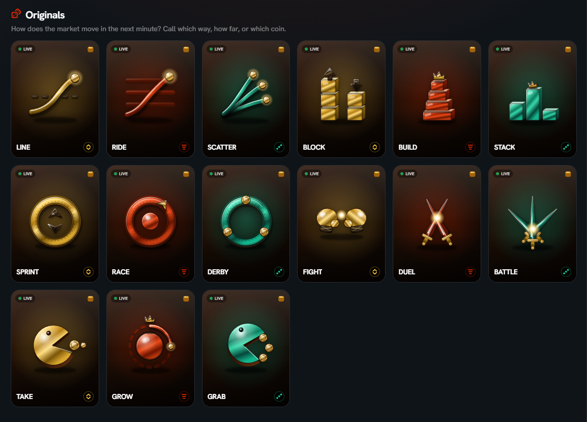

# 2. Prediction / Linera Originals

#### 2.1 Game Modes

* 15 game modes have been launched
* **Assets:** BTC, ETH, SOL _(the list may be expanded)_

<figure><figcaption></figcaption></figure>

#### 2.2 How to play one round

1. Choose a game / market
2. Pick an outcome (up, down, crash, moon, winning coin, etc.)
3. Choose your coin stake
4. Wait for settlement (\~1 minute)
5. Wins pay from the pot; losses consume the stake
6. Repeat. Volume, wins/losses, and PnL all feed the badge system

#### 2.3 Game Branch

There will be three branches available for gameplay:

* One branch with 6 outcomes
* One branch with 2 outcomes
* One branch where players select the winning coin

**Note: 6-Outcome Branch**

* Select **1 of the 6 outcomes** that you predict the price will reach within the next **1 minute**.
* **Check the result:** for example, if a bet is placed during minute **n**, the result will be determined based on the **closing price of minute n+1**.
*   **Tokens are returned immediately** based on the amount of GMIC wagered multiplied by the leverage at the time the bet was placed. The leverage is calculated as:

    **Total pool across 6 outcomes / Total amount of GMIC wagered on the selected outcome**

#### 2.4 Farming tips

* Play **every day**, not one burst session
* Positive **PnL** matters more than empty spam — badges weigh activity and performance
* Do not all-in a single round; keep coins for a daily streak
* Claim badges **the next day** on the Portal
* Referrals mainly help the **Socializer** badge

#### **2.5** Notes

Not all 15 games are currently playable. Only games with an active pool are available to play; the remaining games are currently unavailable

<figure><figcaption></figcaption></figure>

LIVE POOL 6629: Playable

<figure><figcaption></figcaption></figure>

LIVE POOL - : Not currently playable
